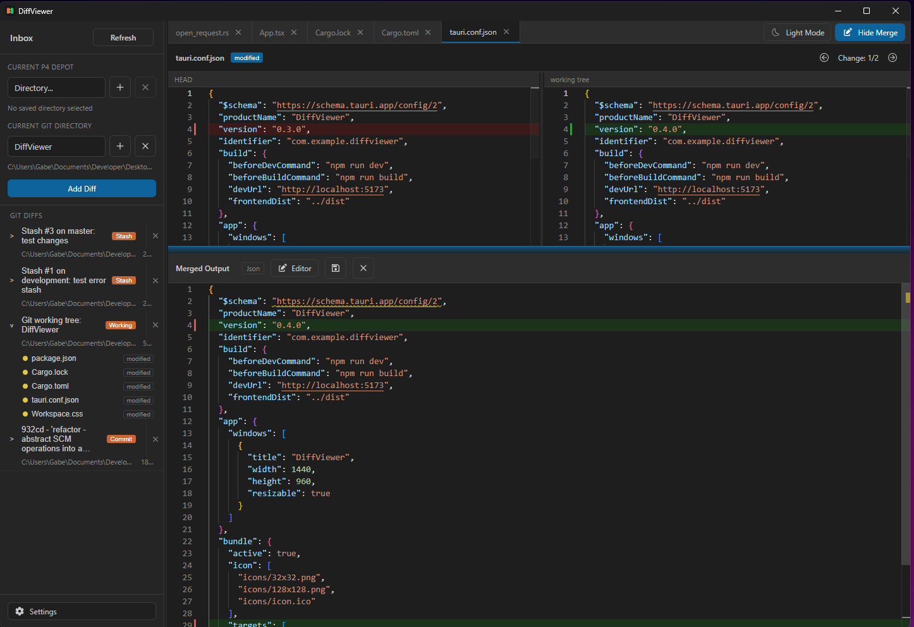
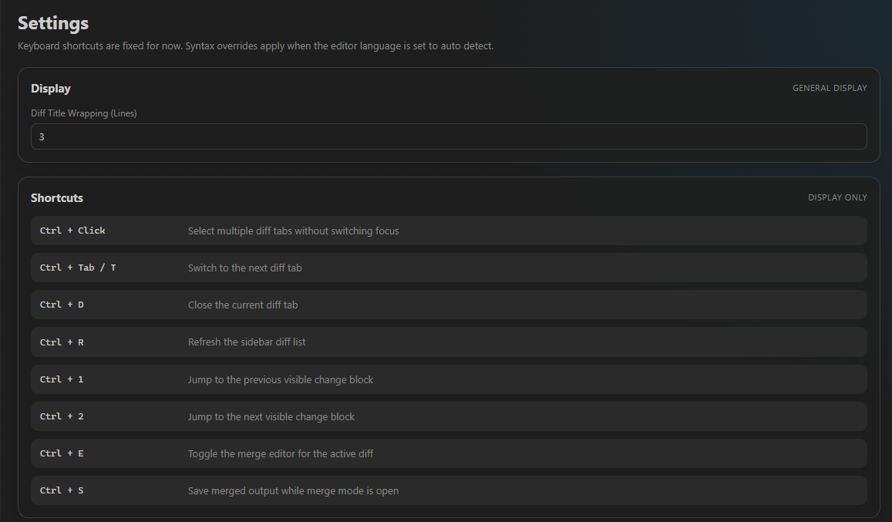
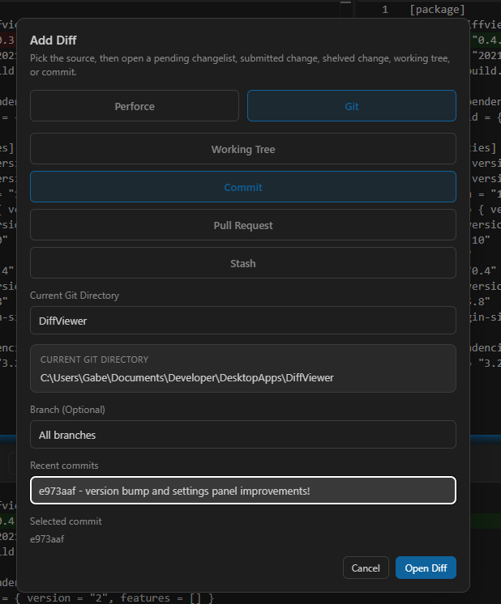
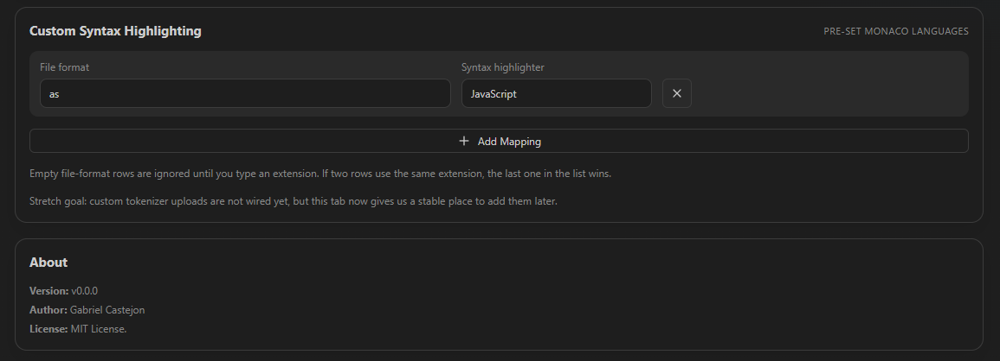

<div align="center">
  
  <h1>DiffViewer</h1>
  <p>A modern, lightning-fast desktop diff tool for Git, Perforce, patch files, and external two-file comparisons.</p>
</div>

---

## Screenshots

| Diff Editor | Settings |
|:---:|:---:|
|  |  |
| **Add Diff Dialog** | **Syntax Highlighting** |
|  |  |

## Features

- **Multi-SCM Support:** Native integrations for Git and Perforce right out of the box.
- **Advanced Diff Engine:** View changes across working trees, commits, pull requests, and stashes.
- **Merge Editor:** Built-in merge conflict resolution tool for complex files.
- **Custom Syntax Highlighting:** Configure custom file-extension mappings using built-in Monaco language support.
- **High Performance:** Built on Tauri + React, leveraging a blazing-fast Rust backend for filesystem access and diff parsing.

## Getting Started

### Development

Use `npm run tauri:dev` for flows that depend on Tauri commands or local filesystem access. Use `npm run dev` only for browser-only UI iteration.

```bash
npm install
npm run build
cd src-tauri
cargo test
cd ..
npm run tauri:dev
```

### Verification

Before merging feature work, run:

```bash
cd src-tauri
cargo test
cd ..
npm run typecheck
npm run build
```

## Architecture

- `src-tauri/src/main.rs` wires app state, startup open requests, and Tauri command registration.
- `src-tauri/src/commands/` contains thin Tauri command adapters.
- `src-tauri/src/services/` contains reusable app behavior such as render, merge, and open-request handling.
- `src-tauri/src/content_source.rs` defines typed JSON models for content sources and write targets.
- `src-tauri/src/scm.rs` owns provider import/refresh behavior, while `src-tauri/src/scm/` contains reusable SCM support for P4 config and process execution.
- `src-tauri/src/diff_engine/` contains parsing, two-way diffing, alignment, rendering, and merge primitives.
- `src-tauri/src/store/` owns SQLite schema and persistence helpers.
- `src/hooks/` contains reusable React state and coordination hooks.
- `src/diffDomain.ts` centralizes frontend parsing for backend JSON fields.

## License

This project is open-source and available under the **MIT License**.
